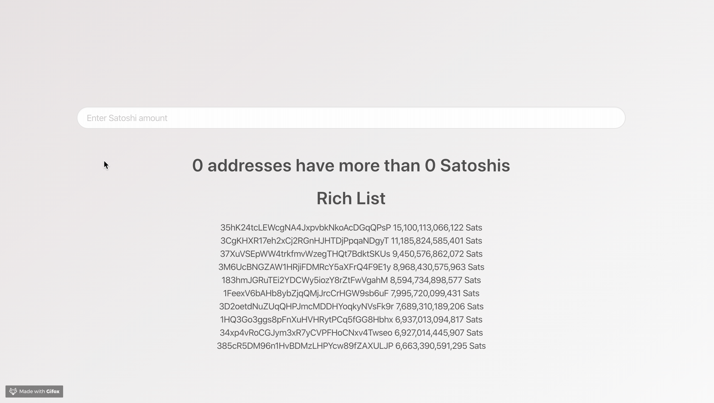

# Satoshi Analytics

<p align="center">
    
</p>

Satoshi Analytics is a website that displays useful information about Bitcoin addresses. 

## Features

Currently shows how many addresses hold the amount of Sats you specify.
Displays the Bitcoin rich list.

## Installation

Run 
``` npm run start ``` 

## License

Satoshi Analytics is available under the MIT license. See the [LICENSE](LICENSE) file for more info.